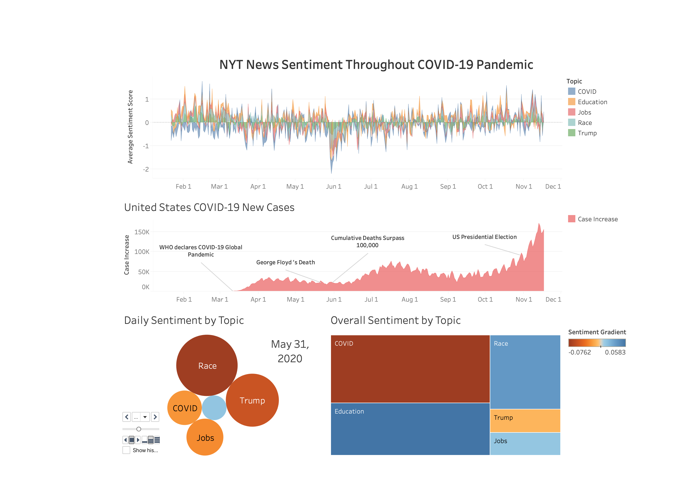

# NYT-Sentiment-Analysis

## Description about the visuals

1. Sentiment by topic throughout 2020</li>
&nbsp;a.	Each topic (COVID, education, jobs, race, and Trump) was overlayed on the same graph and visualized with the area feature. The Y-axis represented the     sentiment score and the X-axis represented time.</li>
2. US COVID-19 New Cases with ‘major’ events annotated</li>
&nbsp;a.	New COVID Cases for the United States was depicted over time</li>
&nbsp;b.	Major events that may have influenced media sentiment were annotated for reference</li>
3. Daily Sentiment by Topic</li>
&nbsp;a.	Magnitude of sentiment portrayed by size</li>
&nbsp;b.	Direction of sentiment portrayed by color gradient</li>
4. Overall Sentiment by Topic</li>
&nbsp;a.	Magnitude of sentiment portrayed by size</li>
&nbsp;b.	Direction of sentiment portrayed by color gradient</li>
